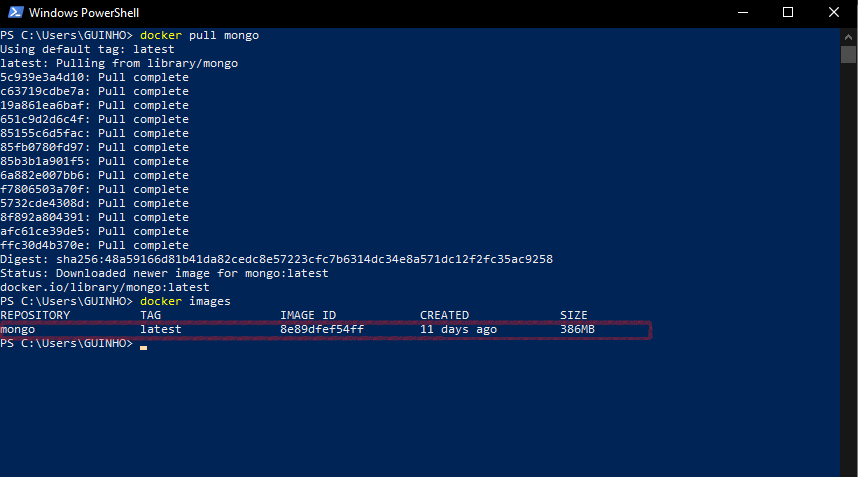
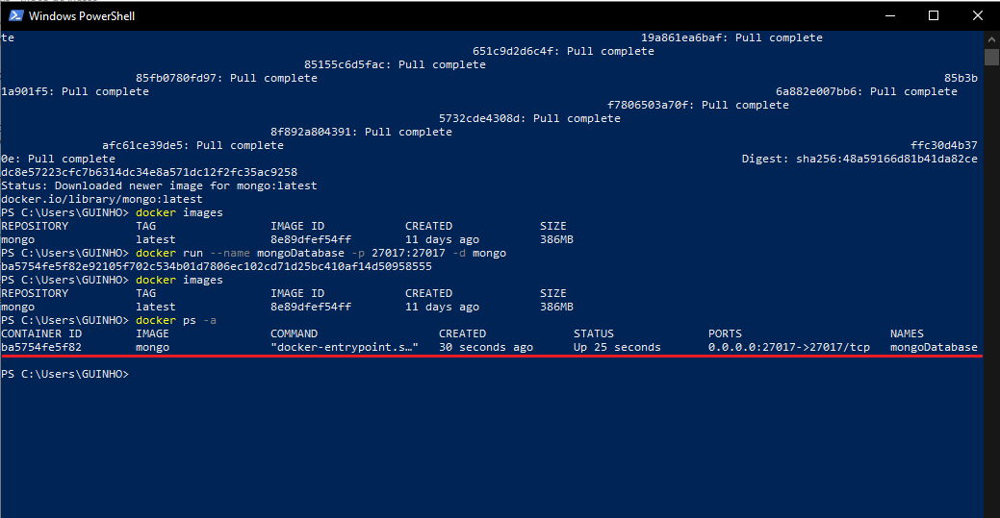
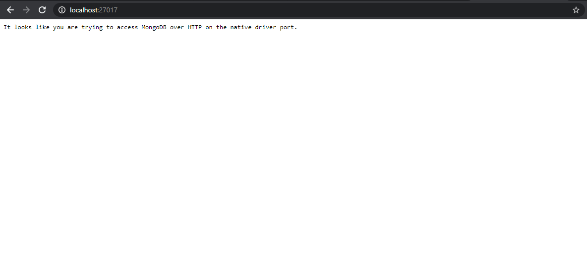

# CRUD-with-mongoDB
CRUD created with mongo + mongoose + docker

docker + mongoDB + mongoose : CRUD com mongoDB

Vou usar o Windows 10 como sistema operacional, então vamos lá pro tutorial.

Primeiro, no windows certifique-se de que o seu w10 é o w10 pro ou enterprise , porque se não for o docker não irá instalar.
link do docker:https://hub.docker.com

Baixem e instalem o insomnia por aqui https://insomnia.rest/download é um programa onde você pode testar suas aplicações REST ao invés de testá-las no navegador.

Vão agora no powershell do seu w10 e digitem, docker pull mongo. Espere um pouco e assim irá baixar a versão mais recente do mongo.
Depois de baixado, digite docker images e irá aparecer a sua imagem do mongo.

Execute ainda no powershell, docker run --name mongoDatabase -p 27017:27017 -d mongo. Onde mongoDatabase é o nome do container a ser criado.Se você quiser saber mais sobre os outros parâmetros acesse:
https://medium.com/@renato.groffe/docker-nosql-executando-o-mongodb-e-o-redis-a-partir-de-containers-3c143e920f09.
O link acima é da onde foi tirado a maior parte de instalação do mongo desse tutorial, créditos ao Renato groffe que foi o criador do tutorial.

Digite docker ps -a e deve aparecer a sua imagem mongo com o nome que você criou o container.

Agora pra você saber se o mongo está rodando, digite no seu navegador, localhost:27017 e deve aparecer essa mensagem:

Baixe o mongoDB compass aqui https://www.mongodb.com/download-center/compass para você poder visualizar suas database do mongo

Instale o pacote mongoose no seu projeto utilizando yarn, npm ou qualquer outro package manager de sua escolha
aqui usaremos o yarn.
yarn add mongoose.

Créditos ao site :http://nodebr.com/nodejs-e-mongodb-introducao-ao-mongoose/
https://medium.com/@renato.groffe/docker-nosql-executando-o-mongodb-e-o-redis-a-partir-de-containers-3c143e920f09
e a Rocketseat, pois várias informações foram tiradas deles.
